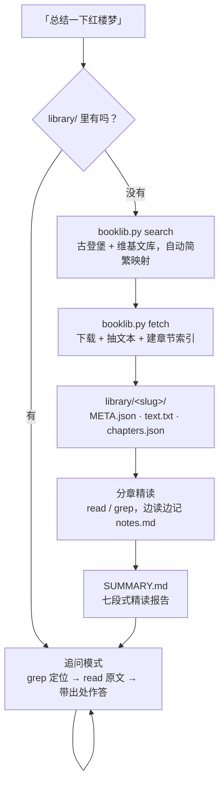

<h1 align="center">reading-summary-skill</h1>

<p align="center">
  <b>说一句「总结一下红楼梦」，Agent 帮你把书下下来、读完、写出精读报告，<br>
  然后这本书就一直在你项目里，随时可以接着问。</b>
</p>

<p align="center">
  <a href="LICENSE"></a>
  
  
  <a href="skills/reading-summary/SKILL.md"></a>
</p>

---

## 30 秒看懂

你问 AI「红楼梦讲了什么」，它凭训练记忆答一段，听着像那么回事，但你没法核对，
换个问题就开始编。**因为它根本没读那本书。**

这个技能换了个做法：**先把书真的下载下来，读完，再说话。**

```
你：总结一下红楼梦这本书讲了什么

Agent：
  → 检索来源              Project Gutenberg #24264（120 回全本）
  → 下载入库              library/hong-lou-meng/  72 万汉字
  → 建章节索引            120 回，回目全部识别
  → 分章精读 + 记笔记     notes.md，每条带回目定位
  → 输出七段式精读报告    SUMMARY.md，约 950 字

  《红楼梦》已入库，接下来可以直接问我：
    · 黛玉葬花在第几回？前后发生了什么？
    · 王熙凤的权力是怎么一步步失去的？
```

关键在最后一步。书留在你项目里了，**下一句、下一周、下一个新会话，都能接着问**，
而且每个答案都带 `第N回` 定位，你能自己翻回去核对。

## 与「让 AI 总结一本书」的区别

| | 通常的做法 | 这个技能 |
|---|---|---|
| 正文 | 没有，凭记忆 | 真下载到 `library/<slug>/` |
| 长书 | 超上下文，只能糊弄 | 章节索引 + 按章读，120 回也能处理 |
| 产出 | 一段书评 | ≥300–500 字七段式报告，长篇经典 800+ |
| 引用 | 说不出在哪 | 带回目/行号，可复查 |
| 追问 | 重新编一遍 | 回原文检索，答案扎根文本 |
| 下次 | 从头再来 | 书还在，笔记还在 |

## 工作流



## 七段式精读报告

不是「1 主旨 + 5 要点」这种要点罗列。七段各有分工，缺一段就有一块看不见：

| 段落 | 篇幅 | 回答什么 |
|---|---|---|
| **一句话主旨** | 40–60 字 | 全书的统一性压成一句，且可被反驳 |
| **结构与脉络** | 80–120 字 | 分几部分、怎么推进——骨架，不是流水账 |
| **人物与关系** | 100–150 字 | 谁要什么、受什么牵制、关系网怎么绷着 |
| **关键事件与转折** | 80–120 字 | 3–5 个转折点，**每个带回目定位** |
| **主题与母题** | 100–150 字 | 论点 → 文本证据 → 阐释，三步走 |
| **能带走什么** | 60–100 字 | 谁该读、为什么、什么情况下别读 |
| **版本与阅读范围** | 2–3 行 | 出处、版本、**实际读了多少** |

框架是从几套成熟方法里各取一件真正管用的东西拼的：Adler《如何阅读一本书》的
分析阅读规则（主旨与结构）、文学分析的标准要素（人物、主题、母题）、
Shortform 的分章证据层、getAbstract 的评价性收束。
非虚构作品自动切换中间两段为「核心概念」与「承重论证 + 证据类型」。

完整模板、字数配比与真实样例：
[`references/summary-framework.md`](skills/reading-summary/references/summary-framework.md)

<details>
<summary><b>展开看《红楼梦》精读报告节选（真实产出，定位均经原文核对）</b></summary>

> **一句话主旨**
> 一个鼎盛世家在自身规则的运转中走向崩塌，而最清醒的几个年轻人只能眼看着，
> 无力阻止，也无处可逃。
>
> **人物与关系**
> 贾宝玉厌弃仕途经济，却又只能靠这个家族提供的庇护活着，这个矛盾贯穿全书。
> 林黛玉与他共享同一种价值判断，因此成为知己，也因此在婚姻市场上毫无胜算；
> 薛宝钗则完全按世俗规则行事，赢得了婚姻，输掉了丈夫。三人构成的不是情感三角，
> 而是三种应对同一套制度的方式。
>
> **关键事件与转折**（节选 2 条）
> - 第五回｜宝玉梦游太虚幻境，看到十二钗判词与《红楼梦》曲——全书结局在此提前公布，
>   此后所有情节都成了对既定命运的印证，悬念从"会怎样"转为"怎么落到那一步"。
> - 第七十四回｜抄检大观园——外部压力第一次转为内部互相清算，园子作为庇护所的功能就此终结。
>
> **版本与阅读范围**
> Project Gutenberg #24264 ｜程高本 120 回，后四十回作者归属存在争议，本报告不预设立场
> ｜通读全部 120 回回目 + 精读第 1、5、13、18、27、74、97、105、120 回

</details>

## 追问才是重点

书入库之后，它就成了可查的语料。Agent 的动作固定是
**先 `grep` 定位 → 再 `read` 原文 → 最后带出处作答**：

```
你：黛玉葬花在第几回？

Agent：黛玉葬花在第二十七回「滴翠亭楊妃戲彩蝶　埋香冢飛燕泣殘紅」。

      起因在前一回：黛玉夜访怡红院吃了闭门羹（第二十六回），第二天正逢饯花之期，
      她把落花收葬并作《葬花吟》。"儂今葬花人笑痴，他年葬儂知是誰"（L6406）
      是全诗题眼——她葬的是花，说的是自己。

      这条线后面还有两处回响：宝玉在山坡后听到这句而恸倒（第二十八回，L6416）；
      第三十回宝玉见龄官画蔷，心里拿她与"颦儿葬花"作比（L7277）。
      所以葬花不是孤立场面，是黛玉结局的预告。
```

三个定位你都能自己翻回去核对——**这就是「扎根原文」的可操作定义**。
检索不到的时候它会直说检索不到，不会拿常识补。

协议细节：[`references/qa-protocol.md`](skills/reading-summary/references/qa-protocol.md)

## 书库长什么样

```
library/
└── hong-lou-meng/
    ├── META.json        # 出处、版本、sha256、字数、获取时间
    ├── text.txt         # 规范化正文 —— 所有回答的唯一依据
    ├── chapters.json    # 120 回索引：序号 / 回目 / 起止行 / 字数
    ├── SUMMARY.md       # 七段式精读报告
    ├── notes.md         # 分章笔记，每条带定位
    └── source/
        └── pg24264.txt  # 原始下载件，只读
```

正文默认不进 git（`library/.gitignore` 已配好），`SUMMARY.md` 和 `notes.md` 会保留——
笔记值得进版本库，几十兆的原文不值得。

## 安装

```bash
git clone https://github.com/KinGao294/reading-summary-skill.git
cd reading-summary-skill
```

把 `skills/reading-summary/` **整个目录**放到 Agent 能发现的位置
（`SKILL.md` 会引用 `references/` 和 `scripts/`，只拷单个文件会瘸）：

| 环境 | 位置 |
|---|---|
| **Cursor（个人）** | `~/.cursor/skills/reading-summary/` |
| **Cursor（项目）** | `<repo>/.cursor/skills/reading-summary/` |
| **Claude Code** | `~/.claude/skills/reading-summary/` |
| **Codex / Grok Bot / 其他** | 各自的 skills 目录；不支持 skills 机制的，把 `SKILL.md` 贴进 system prompt，并把 `scripts/booklib.py` 放进项目里 |

```bash
mkdir -p ~/.cursor/skills
cp -r skills/reading-summary ~/.cursor/skills/
```

`SKILL.md` 头部的 YAML `description` 决定 Agent 什么时候自动调用它——别删。

**依赖**：Python 3.8+，纯标准库。txt / EPUB / HTML 开箱即用；
PDF 需要 `pdftotext`（`apt install poppler-utils`）或 `pip install pypdf`。

## 单独用命令行

`booklib.py` 自己就是个能用的工具，不装 skill 也能跑：

```bash
python3 skills/reading-summary/scripts/booklib.py search "红楼梦" --lang zh
python3 skills/reading-summary/scripts/booklib.py fetch gutenberg 24264 --slug hong-lou-meng
python3 skills/reading-summary/scripts/booklib.py show hong-lou-meng --sections 20
python3 skills/reading-summary/scripts/booklib.py read hong-lou-meng --chapter 27
python3 skills/reading-summary/scripts/booklib.py grep hong-lou-meng "葬花|花冢" --max 20
python3 skills/reading-summary/scripts/booklib.py list
```

<details>
<summary><b>全部子命令</b></summary>

```
search <query> [--lang zh]        古登堡目录 + 维基文库联合检索，自动简繁映射
fetch gutenberg <id>              下载公有领域全本
fetch wikisource "<标题>"          按子页面下载，分回质量最好
fetch arxiv <id>                  下载论文 PDF 并抽文本
fetch url "<url>" --rights "..."  官方免费发布 / OA 直链
add <path>                        登记你自己的文件（txt/epub/pdf/html）
index <slug>                      重建章节索引
read <slug> --chapter N           读一章
read <slug> --start N --limit M   读任意行窗口
grep <slug> "<正则>"               检索，输出带章节定位
list / show <slug>                书库总览 / 单本详情
```

</details>

## 支持的来源

按优先级下探，命中即停：

1. **你自己的文件** —— `add ./book.epub`，买过的、自己写的、附件
2. **公有领域** —— Project Gutenberg（含中文四大名著）、中英文维基文库
3. **开放获取** —— arXiv、OpenAlex、Europe PMC、DOAJ
4. **官方免费发布** —— 出版社免费全书、政府与 NGO 报告、公司白皮书

四级都没有正文时，技能会直说没读到，并给出替代路径
（上传你的正版文件 / 官方样章 / 明确标注的二手资料概要），
而不是假装读过。影子图书馆、盗版站、Sci-Hub 一类未授权分发、
绕过付费墙与 DRM 不在支持范围内。

<details>
<summary><b>已验证的中文书号与两个坑</b></summary>

| ID | 书名 | 备注 |
|---|---|---|
| 24264 | 紅樓夢 | 120 回全，72 万汉字 |
| 23962 | 西遊記 | |
| 23863 | 水滸傳 | |
| 23950 | 三國志演義 | 注意**不叫**「三國演義」 |
| 23839 | 論語 | |
| 7337 | 道德經 | |
| 24226 | 史記 | |

**坑一：简繁。** 古登堡目录存的是繁体「紅樓夢」，用户打简体「红楼梦」直接查不到。
`search` 已通过维基文库重定向表自动补繁体变体。

**坑二：同名英译。** 搜 "Dream of the Red Chamber" 命中的 #9603/#9604 是英文节译本，
不是中文原著。中文提问务必带 `--lang zh`。

</details>

## 致谢

`booklib.py` 不是从零发明的，架构参考了两个现成的开源项目，均为适配重写而非搬运代码：

- **[blazickjp/arxiv-mcp-server](https://github.com/blazickjp/arxiv-mcp-server)**（Apache-2.0）——
  持久化存储 + 章节大纲 + 窗口式读取（`resources/papers.py`、`tools/paper_outline.py`）。
  「文献留在磁盘上、按 section 定位读取」这个让长文档可处理的核心思路来自它。
- **[sea9401/philosophy-mcp](https://github.com/sea9401/philosophy-mcp)**（MIT）——
  多来源逐级下探的获取阶梯（`src/books.ts`）。本项目把其中的 Gutendex 换成了古登堡官方
  目录 CSV：Gutendex 在受限网络下会撞 Cloudflare 质询页，而官方 CSV 下载一次即可离线检索。

摘要框架参考了 Adler《如何阅读一本书》的分析阅读规则、文学分析的标准要素、
Shortform 的分章结构与 getAbstract 的评价性收束。

## FAQ

**Q：120 回的长篇怎么塞进上下文？**
不塞。`chapters.json` 把书切成可定位的章节，Agent 按章读、边读边把带定位的笔记写进
`notes.md`，最后据笔记归纳。这也是为什么追问时它能精确翻回某一回。

**Q：会不会假装读过？**
框架里「版本与阅读范围」是必填项，要求如实写明通读了哪些、抽读了哪些。
拿不到正文时会明说没读到，二手资料概要会显著标注且不写进 `library/`。

**Q：论文、报告能用吗？**
能。arXiv 一条命令入库，非虚构会自动切换成「核心概念 + 承重论证 + 证据类型」的写法。

**Q：需要 API Key 吗？**
不需要。古登堡、维基文库、arXiv 都是免密接口。

**Q：能换成英文输出吗？**
能，默认跟随你的提问语言，也可以直接指定。

**Q：书库能提交进 git 吗？**
`library/.gitignore` 默认忽略正文和原始文件，保留 `SUMMARY.md` 与 `notes.md`。

## 参与

Issue 和 PR 都欢迎，尤其是：更多合法来源适配器、其他语种的章节识别规则、
其他 Agent 平台的安装说明、以及让精读报告更锋利的措辞。

## License

[MIT](LICENSE) © 2026 KinGao294

开源不等于免责：使用者需自行确保对所处理内容拥有合法权利。

---

# English

**Say "summarize 红楼梦" — the agent downloads the book, reads it, writes a structured
deep-read report, and keeps it in your project so you can go on asking questions about it.**

## Why

Ask an AI what a book is about and it answers from training memory. It sounds right,
you can't check it, and it starts inventing as soon as you push. It never read the book.

This skill downloads the text first, then talks. What you get back is not a review —
it's a local library you can keep querying, with every answer carrying a chapter locator
you can verify yourself.

```
you: summarize 红楼梦

  → search sources        Project Gutenberg #24264 (complete 120-chapter edition)
  → download              library/hong-lou-meng/  724k CJK chars
  → build chapter index   120 chapters, all titles recovered
  → read chapter by chapter, taking located notes
  → write SUMMARY.md      seven-part report, ~950 characters

  Now ask: "which chapter is 黛玉葬花?" -> grep, read, answer with 第二十七回 + line numbers
```

## The seven-part framework

Not "one thesis, five bullets". Seven sections, each doing a job the others can't:
**thesis** (40–60 chars, one arguable sentence) · **structure** (how the parts relate,
not a plot recap) · **characters and relationships** · **turning points** (3–5, each with a
chapter locator) · **themes and motifs** (claim → textual evidence → interpretation) ·
**what you take away** (who should read it) · **edition and reading scope** (what was
actually read). Floor is 300–500 CJK characters; a long classic lands at 800–1200.

Distilled from Adler's analytical reading rules, standard literary-analysis elements,
Shortform's per-chapter evidence layer, and getAbstract's evaluative close. Non-fiction
swaps the middle two sections for key concepts and load-bearing arguments with evidence types.

## Install

```bash
git clone https://github.com/KinGao294/reading-summary-skill.git
mkdir -p ~/.cursor/skills
cp -r skills/reading-summary ~/.cursor/skills/
```

Copy the **whole directory** — `SKILL.md` references `references/` and `scripts/`.

- **Cursor:** `~/.cursor/skills/reading-summary/` or `<repo>/.cursor/skills/reading-summary/`
- **Claude Code:** `~/.claude/skills/reading-summary/`
- **Codex / Grok Bot / others:** your skills directory, or paste `SKILL.md` into the system
  prompt and drop `scripts/booklib.py` into the project

Python 3.8+, standard library only. PDFs additionally need `pdftotext` or `pypdf`.

## The CLI works standalone

```bash
python3 skills/reading-summary/scripts/booklib.py search "红楼梦" --lang zh
python3 skills/reading-summary/scripts/booklib.py fetch gutenberg 24264 --slug hong-lou-meng
python3 skills/reading-summary/scripts/booklib.py read hong-lou-meng --chapter 27
python3 skills/reading-summary/scripts/booklib.py grep hong-lou-meng "葬花|花冢"
```

Sources, in order: **your own files** → **public domain** (Project Gutenberg, Wikisource) →
**open access** (arXiv, OpenAlex, Europe PMC, DOAJ) → **official free releases**. When none
of those has the full text, the skill says so and offers alternatives instead of pretending.
Shadow libraries, Sci-Hub-style unauthorized distribution, and paywall or DRM circumvention
are out of scope.

## Credits

`booklib.py` adapts (does not vendor) two existing projects:
[blazickjp/arxiv-mcp-server](https://github.com/blazickjp/arxiv-mcp-server) (Apache-2.0) for
the storage, outline and windowed-read architecture that makes long documents tractable, and
[sea9401/philosophy-mcp](https://github.com/sea9401/philosophy-mcp) (MIT) for the multi-source
acquisition ladder — with Gutendex swapped for Gutenberg's own catalog CSV, since Gutendex
sits behind a Cloudflare challenge on restricted networks.

## License

[MIT](LICENSE) © 2026 KinGao294. You must hold the rights to whatever you process.
